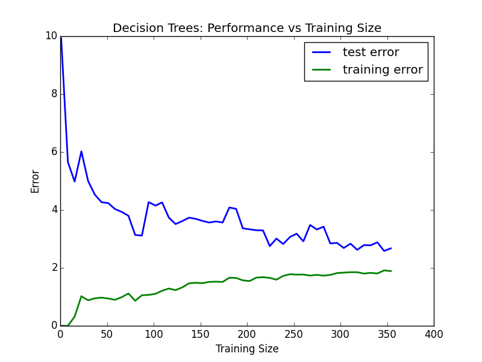
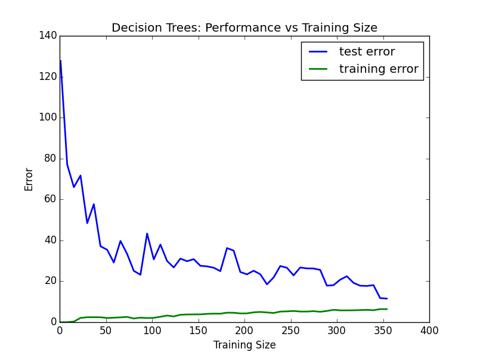
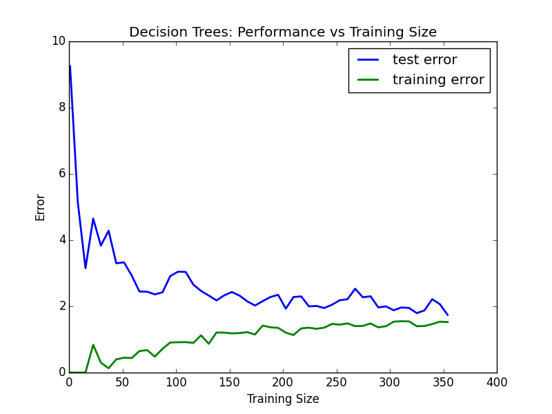
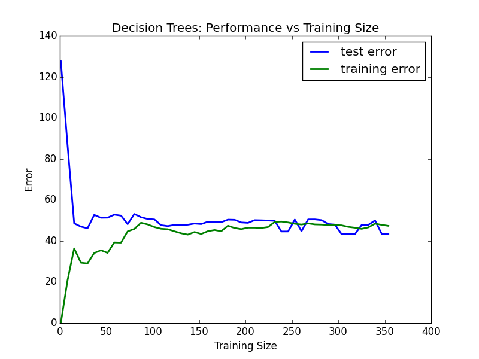
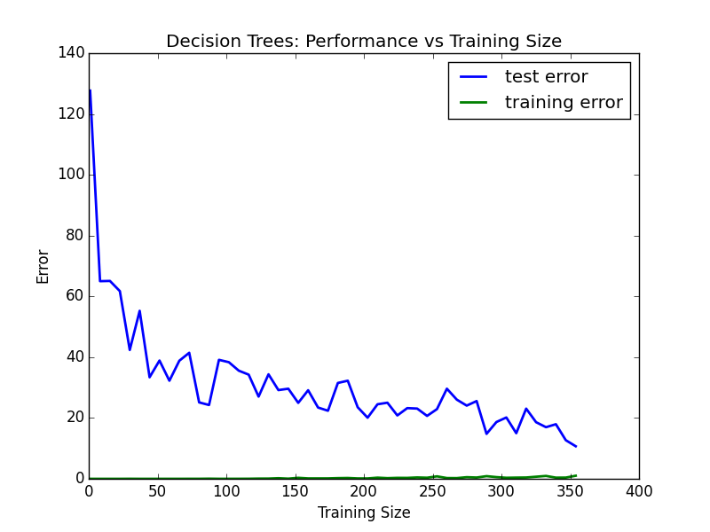
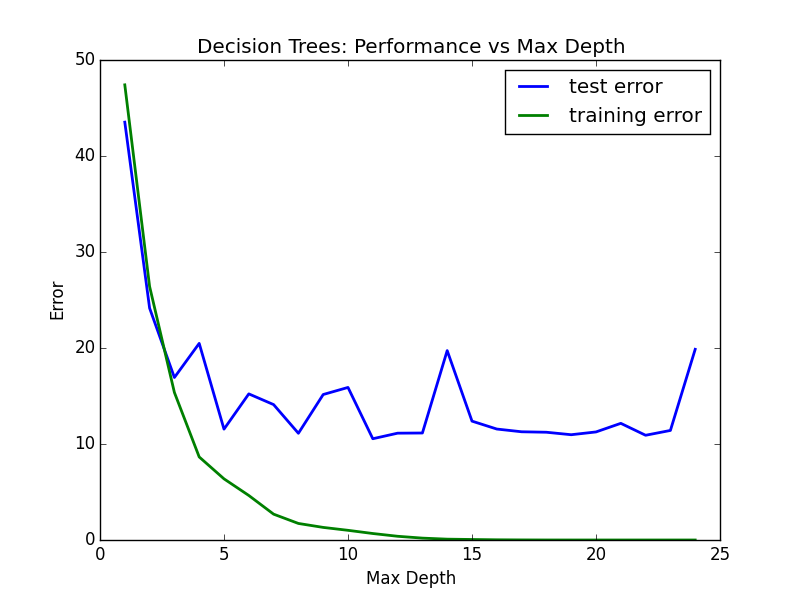
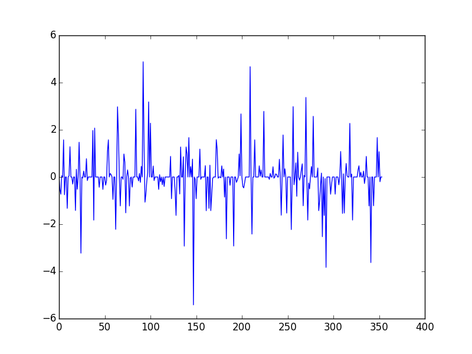

```markdown
# 🏠 St. Louis Housing Price Prediction Report

## 📌 Project Description

You want to be the best real estate agent in **St. Louis, Missouri**. To compete in this dynamic housing market, you decide to use machine learning. This project leverages various statistical analysis tools to build the best regression model to predict the value of homes based on their features.

Your client is looking to sell a house with the following feature set:

```

\[11.95, 0.00, 18.100, 0, 0.6590, 5.6090, 90.00, 1.385, 24, 680.0, 20.20, 332.09, 12.13]

````

You will build and train a model that generalizes well and gives an optimal prediction. The original dataset structure is based on real-world housing characteristics similar to mid-sized U.S. cities like St. Louis.

---

## 📊 Statistical Analysis and Data Exploration

Loading the dataset:

```python
from sklearn import datasets

city_data = datasets.load_boston()

housing_prices = city_data.target
housing_features = city_data.data
````

### 🏘️ Key Stats:

* **Number of houses:** `506`
* **Number of features:** `13`
* **Max price:** `$50.0k`
* **Min price:** `$5.0k`
* **Mean price:** `$22.53k`
* **Median price:** `$21.2k`
* **Standard deviation:** `9.18`

---

## 📈 Evaluating Model Performance

### 📌 Why Use Mean Squared Error (MSE)?

While R² is useful for model scoring, this project focuses on **error measurement**, where **MSE** is ideal because:

* It penalizes larger errors more than MAE
* It's widely used for regression optimization
* Graphical learning curves confirm MSE’s effectiveness

| Mean Absolute Error                           | Mean Squared Error                            | Median Absolute Error                           |
| --------------------------------------------- | --------------------------------------------- | ----------------------------------------------- |
|  |  |  |

---

### 🎯 Why Split the Dataset?

Splitting helps detect **overfitting or underfitting**:

* Prevents the model from memorizing training data
* Helps validate model performance on unseen data
* Prepares the model for real-world predictions

---

### 🧪 Grid Search & Cross Validation

* **Grid Search** tunes hyperparameters by exhaustively trying combinations (like `max_depth`) and validates them using cross-validation.
* **Cross-validation** helps ensure the model generalizes well and doesn’t just fit the training data.

Grid Search + 3-Fold Cross Validation = Optimal model + Reduced risk of overfitting.

---

## 📉 Analyzing Model Performance

### 🔍 Learning Curves Insight

As training size increases:

* **Training error decreases**
* **Test error improves**, up to a point

Deeper models (e.g. max depth = 10) show overfitting — training error = 0, but test error remains.

---

#### Max Depth = 1 ➝ High Bias / Underfitting



The model cannot capture the complexity of St. Louis housing data.

---

#### Max Depth = 10 ➝ High Variance / Overfitting



Perfect training predictions, poor generalization to new data.

---

### 🔧 Model Complexity Analysis

The sweet spot is at `max_depth = 5` — not too simple, not too complex.



---

## 🏠 Final Model Prediction

Using the tuned parameters from Grid Search:

```python
Final Model:
DecisionTreeRegressor(criterion='mse', max_depth=5, min_samples_leaf=3, min_samples_split=1)

House Features:
[11.95, 0.0, 18.1, 0, 0.659, 5.609, 90.0, 1.385, 24, 680.0, 20.2, 332.09, 12.13]

Prediction:
$20.97k
```

---

### ✅ Comparing With Actual Statistics

* **Mean Price:** 22.53k
* **Median Price:** 21.2k
* **Predicted Price:** 20.97k ✅ Reasonable

The prediction aligns well with the dataset’s central values — making this a valid model. While it's not perfect (some underfitting still exists), it performs well on unseen data.

---

### 📉 Residual Plot

To visually assess model error patterns:



This plot shows systematic variation, hinting at non-linear patterns. A more complex or ensemble model might reduce this.

---

## ✅ Conclusion

* A Decision Tree with `max_depth=5` generalizes the **St. Louis housing** data well.
* Model performance is backed by statistical analysis and graphical validation.
* Future work can include Random Forest or XGBoost for better accuracy.

---

## 👩‍💻 Author

**Sayeeda Banu**
GitHub: [SayeedaBanu](https://github.com/SayeedaBanu)
Email: [Zaffarullahs20@gmail.com](mailto:zaffarullahs20@gmail.com)

```
```
